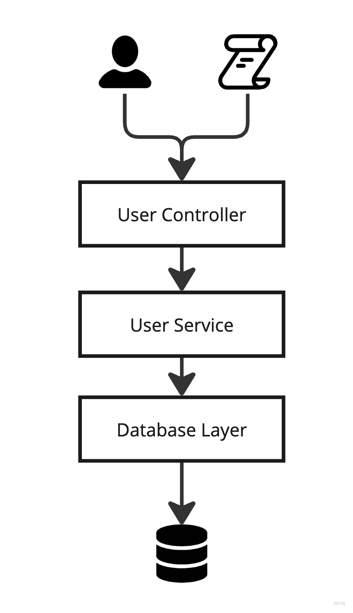

# Hexagonal Architecture

Hexagonal Architecture, also known as Ports and Adapters helps create highly maintainable and testable applications
by isolating the core logic from external components.

## Overview

This repository serves as a practical guide for transitioning from a traditional layered application to Hexagonal Architecture.

## Structure

The steps to transitioning from a traditional layered application to Hexagonal Architecture will be embodied in different branches

### [1. Layered Application](https://github.com/jcalarcon98/hexagonal-architecture/tree/layered-application) 

This branch demonstrates a typical layered application that lacks best practices, essential principles such as Dependency Injection (DI)
and Dependency Inversion Principle (DIP), making it challenging to test and maintain, on this step we are going to have an application like this:

### [2. Moving to Hexagonal Architecture using Transaction Script I](https://github.com/jcalarcon98/hexagonal-architecture/tree/hexagonal-architecture-structured-by-transaction-script-one)

In this branch, we introduce DI, DIP and Ports and Adapters concepts to transform the layered application into one that
follows Hexagonal Architecture principles, one thing to remark is that each transaction is handled within a single service.

By applying these basic concepts we obtain a loosely coupled application that simplifies testing and maintainability.

Our application architecture looks as follows:

### [3. Moving from Transaction Script I to Transaction Script II](https://github.com/jcalarcon98/hexagonal-architecture/tree/hexagonal-architecture-structured-by-transaction-script-two)

While the previous step was enough, this branch improves the architecture remarkably by transitioning from transaction script I to transaction script II.
This change involves splitting our business logic into separate use cases for better separation of concerns. The final architecture of this branch is illustrated below:

By following the steps described in this repository, you will gain valuable knowledge into implementing Hexagonal Architecture in your applications, improving maintainability and testability.

## Tech Stack

- Python 3.12.0
- FastApi to expose our use cases.

## Resources

To enhance your architecture knowledge or to learn from scratch, I highly recommend following [Valentina Cupać](https://valentinacupac.com/)
and the [Tech Excellence community](https://www.techexcellence.io/), they consistently provide top-quality content on relevant topics.

## Do you have questions?

Feel free to create a new [issue](https://github.com/jcalarcon98/hexagonal-architecture/issues/new) to discuss any concerns or questions you may have

## Do you want to contribute?

There are several ways you can contribute to this project:

- Extending the context of this application
- Improving the code

Feel free to open a Pull Request, I'll be glad to review it.
